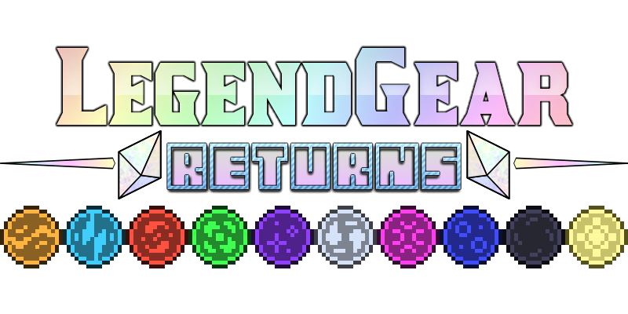

# LegendGear Returns

**LegendGear Returns** is the 1.12.2 port of LegendGear by NMcCoy, it combines the content from both [LegendGear 1 (1.5.2)](https://www.minecraftforum.net/forums/mapping-and-modding-java-edition/minecraft-mods/1287725-legendgear-items-and-more-drawing-inspiration-from) and [LegendGear 2 (1.7.10)](https://www.minecraftforum.net/forums/mapping-and-modding-java-edition/minecraft-mods/2198530-legendgear-2-version-2-b-2-1-updated-3-9-2015). Our port represents the best of both versions!

Most of the mod's content is heavily inspired after classic games like the Legend of Zelda and other RPGs. The main central focus of the mod however are the falling stars.

---

## Events

- **Falling Stars:** Extremely powerful sources of celestial energy. These stars can occasionally be found falling down at night!
- **Lightning-Struck Blocks:** When grass, dirt or sand are struck by lightning, they will become lightning-struck and can be dug up with a shovel for Fulgurite.
- **Stardust / Infused Stardust:** Placing a star piece on the crafting grid will net you three piles of dust, they are also obtained when a fallen star has not been caught for too long.
- **Star Piece / Infused Star Piece:** When a star is caught, you will gain a star piece and quite a bit of experience. Hold right-click for a while to infuse it at the cost of three levels by default, both star piece types are used in a variety of recipes.
- **Starstone / Infused Starstone:** Beautiful decorative blocks, the infused variant will also glow with a sheen and flash through many colors.

## Equipment

- **Bomb Bag:** Bombs picked up will be stored into the bag until it's full. Right-click to throw one of the stored bombs to the ground or left-click active bombs to defuse them.
- **Bombs:** Right-click to throw it to the ground. It will explode after a few seconds.
- **Caltrops:** Place them on the ground to use them as traps. There is a chance for them to wear out completely.
- **Magic Boomerang:** Right-click to throw it. The boomerang will magically return to you and pick up any items it touches.
- **Magic Mirror:** Hold down right-click to teleport to the last point you stood on that was exposed to the sky.
- **Phoenix Charm:** This bauble saves you from death while it is equipped. Has only one use.
- **Phoenix Feather:** Saves you from death while it is anywhere in your inventory. Has only one use.
- **Quiver:** Arrows picked up will be stored into the quiver until it's full. Right-click to store arrows into it or sneak and right-click to remove arrows from it.
- **Slime Sword:** It's a sword that does no damage. WOW!
- **Spotting Scope:** Hold down right-click to zoom. Quickly right-click to temporarily mark a location instead.
- **Starglass Sword:** All attacks with this sword have a 50% chance to deal a critical hit.

## Medallions

These are one-use items that can be thrown to cast immensely powerful spells at the impact point, but you'll first need to charge them through specific methods. Fully charged medallions are also used to craft special gear and amulets.

- **Earth Medallion:** Causes a massive shockwave that will throw off mobs into the air and deal over 70 damage by default. Requires you to take fall damage to charge it.
- **Ender Medallion:** Emits an expanding unstable ring of energy that will teleport mobs inside it once it reaches its threshold. Requires you to take damage from End mobs to charge it.
- **Fire Medallion:** Charges up three spinning fireballs that will circle around for a few seconds before exploding, any mobs within will be dealt over 80 damage and burn for 20 seconds by default. Requires you take fire damage to charge it.
- **Wind Medallion:** Causes a huge arrow storm that will constantly rain towards mobs below, each arrow deals 4 damage by default and will ignore invincibility frames. Requires you to take arrow damage to charge it.

## Medallion Equipment

Special equipment created with the power of the medallions.

- **Aero Amulet:** When this bauble is equipped, it will completely protect you from arrows shot at you.
- **Geo Amulet:** When this bauble is equipped, fall damage will be negated, and you will emit shockwaves on the ground after falling through great lengths.
- **Headband of Valor:** Makes you deal more damage when equipped.
- **Pyro Amulet:** When this bauble is equipped, fire damage will heal you instead.
- **Titan Band:** When this bauble is equipped, right-clicking mobs with an empty hand will pick them up. Right-click again to throw them!
- **Whirlwind Boots:** These pair of boots make you run much faster when they're equipped.

## Medallion Augmentation

**COMING SOON!**

## Miscellaneous

- **Clay Urn:** Right-click or throw an item to it to store the item to it. Breaking it will make it drop the item.
- **Dimensional Catalyst:** Right-click blocks with it to teleport them around, it can also be used to properly extract Azurite ore and various recipes.
- **Fortune Cookie:** Eat it to receive a fortune. You just never know what you might get!
- **Fulgurite:** A rare material obtained from the ground after a lightning strike.
- **Hookshot:** Right-click to fire it. Once hooked into a block, it'll pull you towards it.
- **Magic Powder:** Right-click certain blocks or mobs for shapeshifting surprises!
- **Milk Chocolate:** Cures all status effects while also being chocolatey.
- **Reed Pipes:** Hold down right-click to play it! Pitch is determined by the angle you're looking at and notes are determined by sneaking.
- **Rock Candy:** These sugary treats are made from various different materials. They give different effects depending on the material.
- **Skybeam Block:** When activated with redstone, it will emit a cosmetic beam towards the sky!
- **Starbeam Torch:** Place these together and hop on them to use them as rails! Try hopping on them while running.
- **Starglass Ingot:** New alloy made out of sand and infused stardust.
- **Starsteel Ingot:** New alloy made out of iron and infused stardust.
- **Sugar Cube:** Storage blocks of sugar. Gets destroyed when under rain or in water.
- **Sword Pedestal:** Allows you to place swords within it. Place one on top of a Skybeam Block and insert a sword to activate it!

## World

New features that can be found throughout the world.

- **Azurite:** This magical blue metal is connected to star energy. Clusters of Azurite ore can be found mainly at high altitude biomes such as Extreme Hills. 
- **Bomb Flowers:** You can find these around lava pools. Left-click them to get them to drop bombs, but be sure to disable them in time to pick them up! The flowers will regenerate after a short amount of time.
- **Mystic Shrubs / Energized Mystic Shrubs:** These can spawn everywhere around the Overworld and can be broken for loot, the shrubs will regenerate after a short amount of time. During a thunderstorm, they will become energized and have even better loot!

## Tweaks

There are also some tweaks to make your game even more interesting than before...

- **Emerald Shards:** Creatures slain by you will occasionally drop emerald shards. Combine these into pieces and then into full emeralds to trade with villagers!
- **Hearts:** Creatures slain by you will occasionally drop hearts. Pick them up to heal some health!
- **Prismatic Experience Orbs:** Tired of those boring green experience orbs? They're rainbow with a different texture now!

---

## 🙏 Special Thanks

- Originally creating LegendGear 1-2 (both licensed under CC BY-NC-SA 4.0) and creating a lot of memories to a lot of players ~ NMcCoy
- Updated Clay Urn model ~ NicholasW
- Contacting NMcCoy for permissions and archiving the [original source code](https://github.com/xJon/LegendGear) ~ xJon

## 🌐 Translators

- None yet!

---

## Licensing

Code and assets from the original LegendGear mods are licensed under CC BY-NC-SA 4.0 (see LICENSE.txt).

Assets specifically made for this port are licensed as All Rights Reserved (see LICENSE-ASSETS.txt).

---